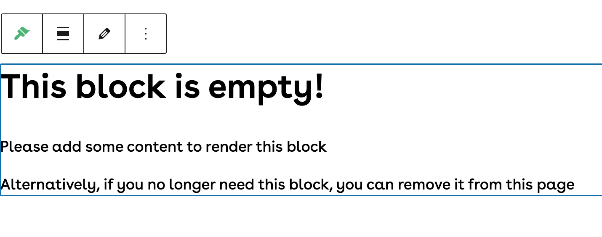

# Base Modules

This directory houses generic "anonymous components", meaning that they do not require a class or logic, and are simpley defined use a Blade view.

---

### Empty Block

This block is displayed when the required data to render a block is missing.



#### Usage

`<x-bloom-base.empty-block />`

#### Example
```php
@if (canRenderBlock)
    ...
@else
  <x-bloom-base.empty-block />
@endif
```

---
