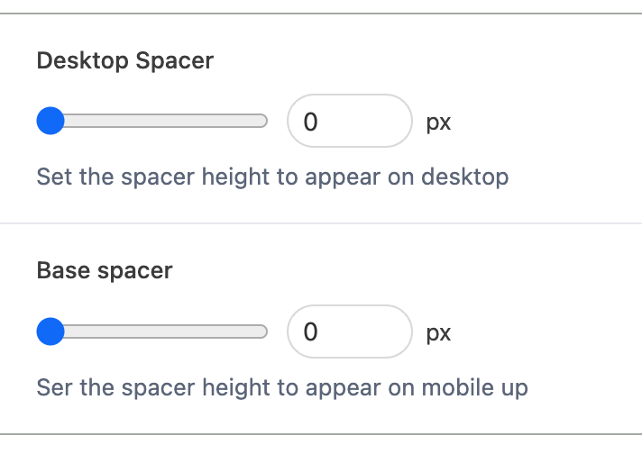

# BaseSpacer

---

The BaseSpacer module adds a responsive custom spacing block to the gutenberg editor which allows the CMS user to add a base height and then a height for desktop devices and up.

