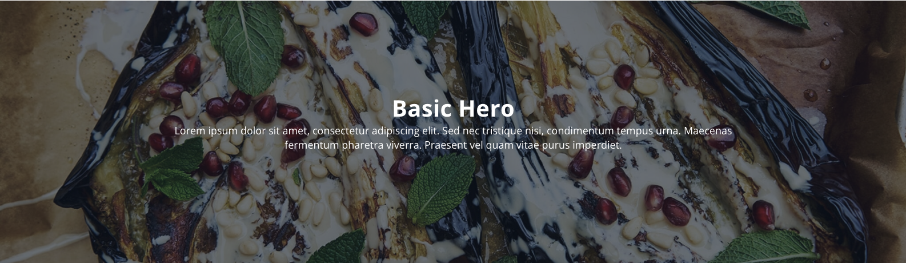

# BasicHero

---

The Basic Hero block requires the Base Image module to work. 

It is designed as an outer block, sets a background image with an overlay and accepts the Tag block, Heading and Paragraph elements as innerblocks. 

