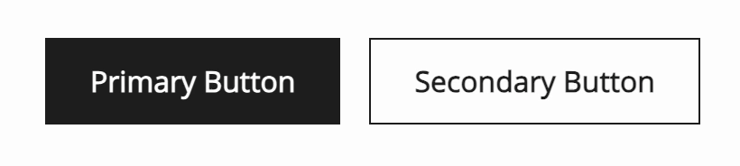
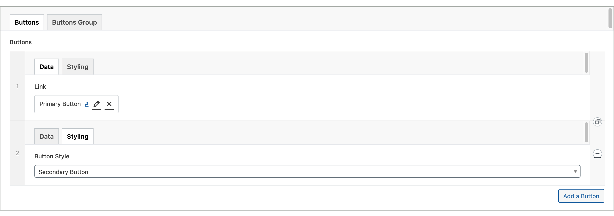

# Buttons

---

The Buttons ACF block enables us to add groups of buttons to the Gutenberg editor and use the individual components within templates, to ensure consistent styles/interactions.



### Table of Contents

- [ACF Block](#acf-block)
- [Buttons Component](#buttons-component)
    - [Props](#buttons-props)
    - [Usage](#buttons-usage)
- [Button Component](#button-component)
    - [Props](#button-props)
    - [Usage](#button-usage)
- [Usage](#usage)

## ACF Block



#### "Buttons"
The buttons tab is an ACF repeater field allowing multiple buttons to be added

"**Data**"
- Min 1
- Max 3
- Opens a Native link window allowing users to:
    - Select an internal link
    - Add an external link
    - Anchor tags can also be added
    - Tick whether to open in new tab

**Styling**
- Can select styling of button
    - Primary (default)
    - Secondary
- More can be added.

### Buttons Group
- Alignment
    - Left
    - Center
    - Right

The Buttons block view, then calls the Buttons component

## Buttons Component

The Buttons Component controls the alignment and the looping of the singular button component.

#### Buttons Props

- `$buttons`
    - array
    - required


- `$alignClass`
    - string
    - optional
    - default - aligned left

#### Buttons Usage

```php
<x-bloom-buttons :buttons="$buttons"  :align="$buttonAlignment"/>
```

```php
<x-bloom-buttons :buttons="[
  [
    'url' => $button['url'],
    'title' => 'See all',
    'button_style' => 'btn-secondary',
    'button_theme' => $pageColor
  ]
]"/>

```

## Button Component

The Button Component can be used within the Buttons Component or data can be passed into it manually,

#### Button Props

- `$url`
    - string
    - required


- `$text`
    - string
    - required


- `$target`
    - boolean
    - optional


- `$buttonStyle`
    - string
    - optional

#### Button Usage

When used with data from ACF Buttons Block:
```php
 <x-bloom-button :button="$button" />
```

When used manually:
```php
<x-bloom-button :button="[
    'url' => $link,
    'title' => 'See all',
    'button_style' => 'btn-secondary',
]"/>
```


