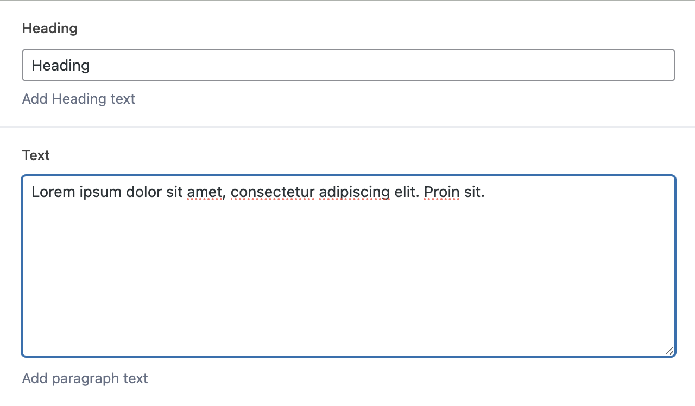

# HeadingText

---

The HeadingText block is a simple block for a Heading and Paragraph. This is designed as an inner block, to be used inside a Section block or other accepting block. 

It's base styles set the heading and text to be in 2 columns side by side. 

