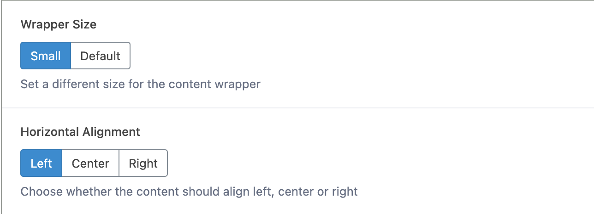

# Section

---

The Section block is to be used as an outer block, for other blocks to be placed inside it. The Section provides a wrapper - selectable as either default or small. It also allows you to horizontally align content.

